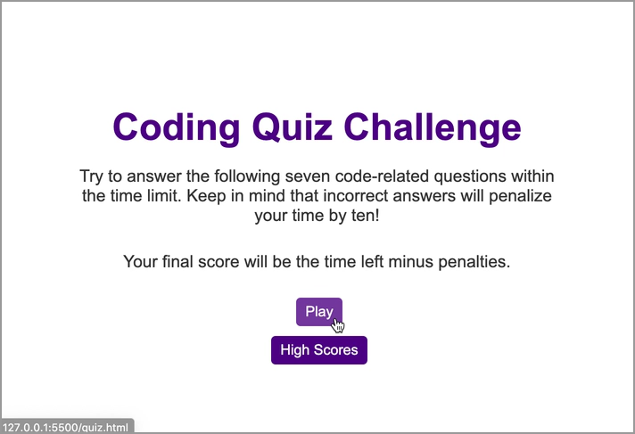
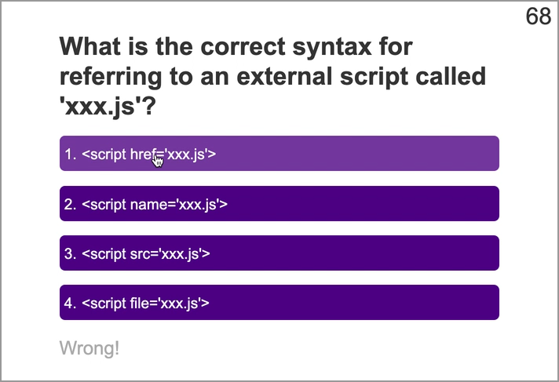
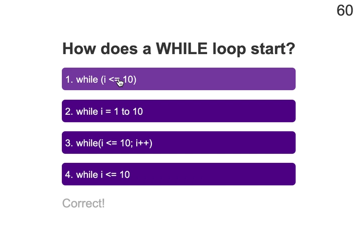
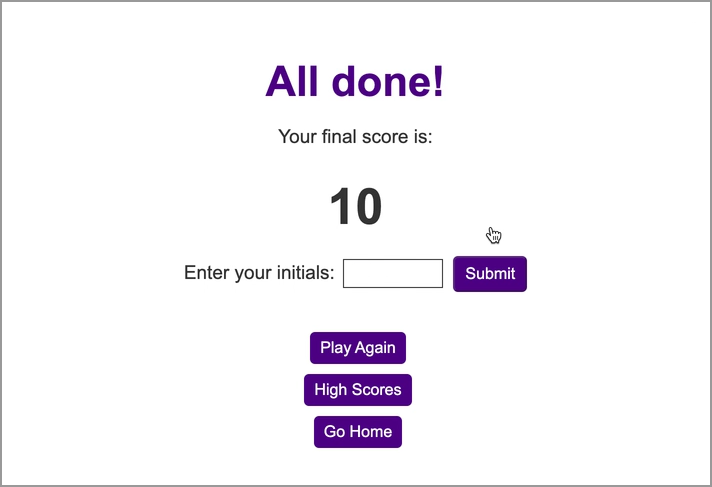
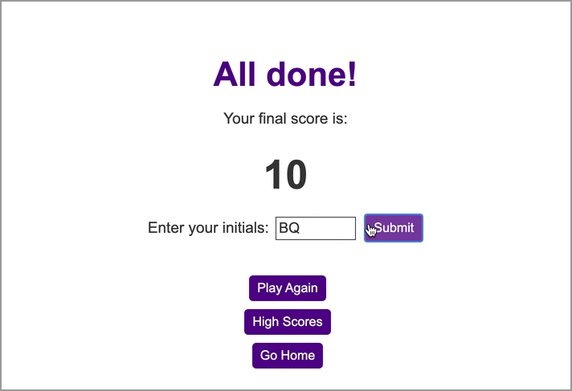
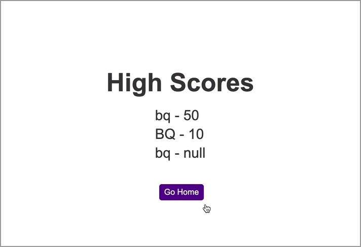

# Coding-Quiz

## Description

A timed coding quiz with multiple-choice questions. This app runs in the browser and features dynamically updated HTML and CSS powered by JavaScript code.

## User Story

```
AS A coding boot camp student
I WANT to take a timed quiz on JavaScript fundamentals that stores high scores
SO THAT I can gauge my progress compared to my peers
```

## Acceptance Criteria - All delivered

```
GIVEN I am taking a code quiz
WHEN I click the start button
THEN a timer starts and I am presented with a question
WHEN I answer a question
THEN I am presented with another question
WHEN I answer a question incorrectly
THEN time is subtracted from the clock
WHEN all questions are answered or the timer reaches 0
THEN the game is over
WHEN the game is over
THEN I can save my initials and score
```

## URL and Repo Locations
The url for the site is: https://brandyquinlan.github.io/Coding-Quiz/
The repo is located here: https://github.com/brandyquinlan/Coding-Quiz

## Screenshots of Coding Quiz
Quiz Home Page:


Incorrect Answer:


Correct Answer:


Quiz is over after last question or when time runs out:


Add Initials to record score:


High Scores:


## Questions
Please contact me with questions:

Brandy Quinlan
<br>
Email: <brandyquinlan@gmail.com>
<br>
Github: [https://github.com/brandyquinlan/](https://github.com/brandyquinlan/)


